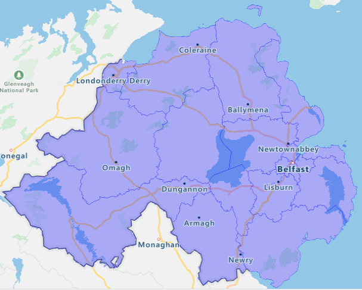

# NI ASSEMBLY ELECTION GRAPHS

A flask web application made to display the graphs I created in order to examin voting breakdown and voter statistics.   Data sourced from <a href="http://electionsni.org/data/">http://electionsni.org/data/</a> 

Code used to generate the graphs can be found in ./generate_graphs 

Find a live version of the site <a href="https://assembly-election-graphs.ew.r.appspot.com/"> here. </a>

